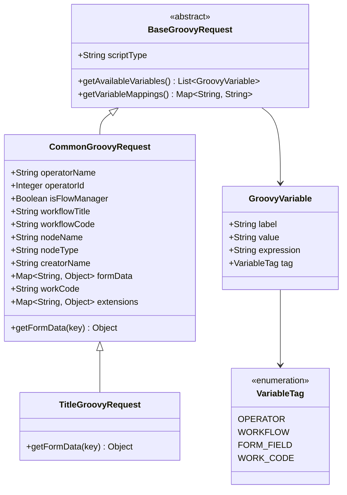
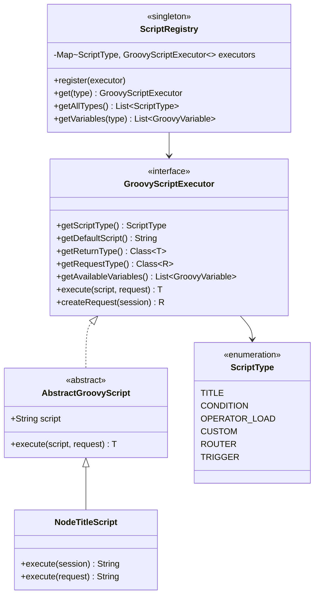
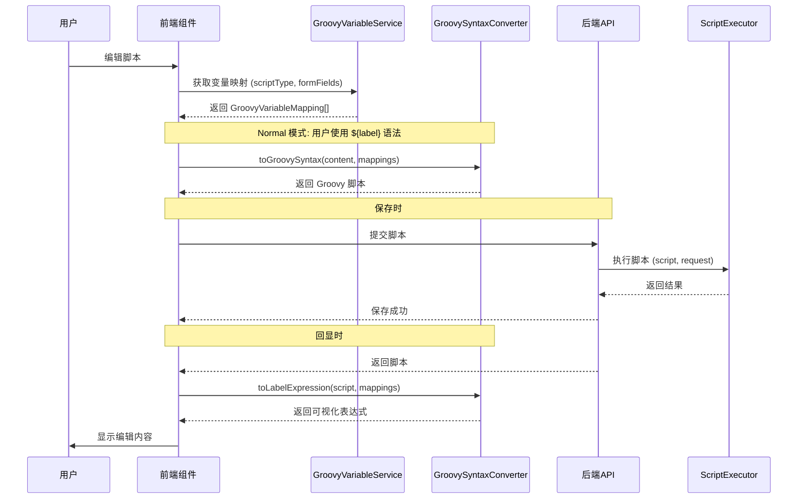
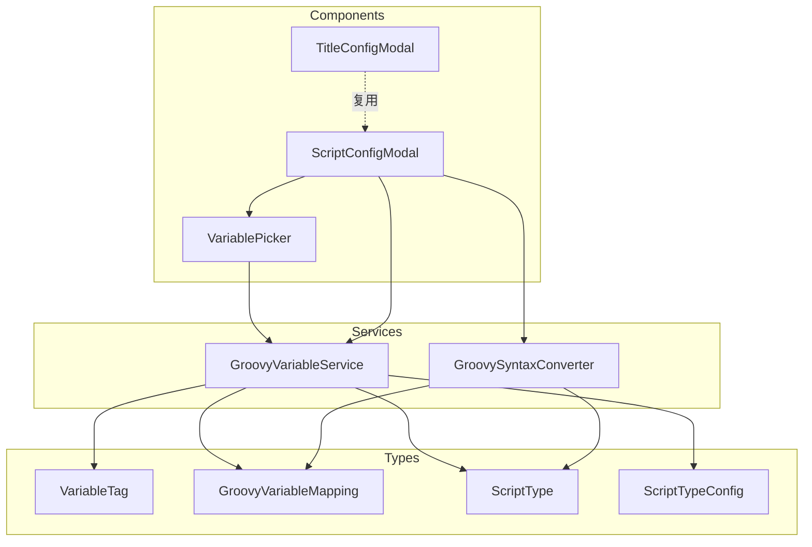

# Groovy 脚本处理架构统一优化计划

## 背景

当前项目存在多个使用 Groovy 脚本的场景（标题脚本、条件脚本、人员加载脚本、自定义脚本等），但缺乏统一的抽象和复用机制：

- **后端**：每个脚本类型独立定义请求对象和执行器，难以扩展
- **前端**：只有标题脚本有完整的可视化配置 UI，其他脚本仅有简单 Input

## 优化目标

1. **后端**：抽象出通用请求基类和脚本执行框架
2. **前端**：抽象出通用语法转换器和可复用配置 UI 组件

---

## 实施方案

### Phase 1: 后端基础设施

| 序号 | 文件 | 描述 |
|------|------|------|
| 1.1 | `flow/java/com/coding-engine-framework/src/mainapi/flow/script/runtime/GroovyVariable.java` | 变量描述类 |
| 1.2 | `flow-engine-framework/src/main/java/com/codingapi/flow/script/runtime/VariableTag.java` | 变量分组标签枚举 |
| 1.3 | `flow-engine-framework/src/main/java/com/codingapi/flow/script/runtime/BaseGroovyRequest.java` | 抽象请求基类 |
| 1.4 | `flow-engine-framework/src/main/java/com/codingapi/flow/script/runtime/CommonGroovyRequest.java` | 通用请求实现 |
| 1.5 | `flow-engine-framework/src/main/java/com/codingapi/flow/script/runtime/ScriptType.java` | 脚本类型枚举 |
| 1.6 | `flow-engine-framework/src/main/java/com/codingapi/flow/script/runtime/GroovyScriptExecutor.java` | 脚本执行器接口 |
| 1.7 | `flow-engine-framework/src/main/java/com/codingapi/flow/script/runtime/AbstractGroovyScript.java` | 抽象脚本执行类 |

### Phase 2: 后端脚本改造

| 序号 | 文件 | 描述 |
|------|------|------|
| 2.1 | `TitleGroovyRequest.java` | 改造为继承 CommonGroovyRequest |
| 2.2 | `FlowSession.java` | 添加 createCommonRequest() 方法 |
| 2.3 | 其他脚本类 | 按需改造使用新框架 |

### Phase 3: 前端基础设施

| 序号 | 文件 | 描述 |
|------|------|------|
| 3.1 | `frontend/packages/flow-types/src/types/groovy-script.ts` | 新增脚本类型定义 |
| 3.2 | `groovy-variable-service.ts` | 增强支持多脚本类型 |
| 3.3 | `groovy-syntax-converter.ts` | 通用语法转换器（从 title-syntax-converter 抽象） |

### Phase 4: 前端组件

| 序号 | 文件 | 描述 |
|------|------|------|
| 4.1 | `ScriptConfigModal.tsx` | 通用脚本配置弹框 |
| 4.2 | `TitleConfigModal.tsx` | 改造为使用通用组件 |
| 4.3 | 其他策略组件 | 按需改造 |

---

## 关键设计

### 后端类图 (UML)



### 后端脚本执行器架构 (UML)



### 前后端交互流程



### 前端组件架构



### 语法转换流程

```mermaid
flowchart LR
    subgraph 用户输入
        A["输入框<br/>你好，${当前操作人}"]
    end

    subgraph Normal模式转换
        B[标签解析] --> C[占位符替换]
        C --> D[表达式构建]
        D --> E[添加注释和函数包装]
    end

    subgraph Groovy脚本
        F["def run(request){<br/>/** @TITLE */<br/>return \"你好，\" + request.getOperatorName()<br/>}"]
    end

    A --> B
    E --> F
```

---

## 验证方式

1. **后端测试**：
   - 运行 `TitleGroovyRequestTest` 确保兼容性
   - 运行 `NodeTitleIntegrationTest` 确保集成正确

2. **前端测试**：
   - 运行 `title-syntax-converter.test.ts`
   - 手动测试 TitleConfigModal 功能

3. **构建验证**：
   - `./mvnw clean install` 后端构建
   - `pnpm build` 前端构建
