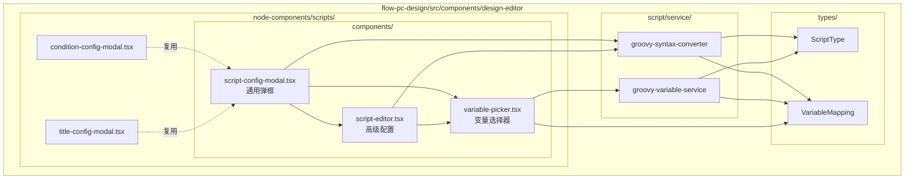
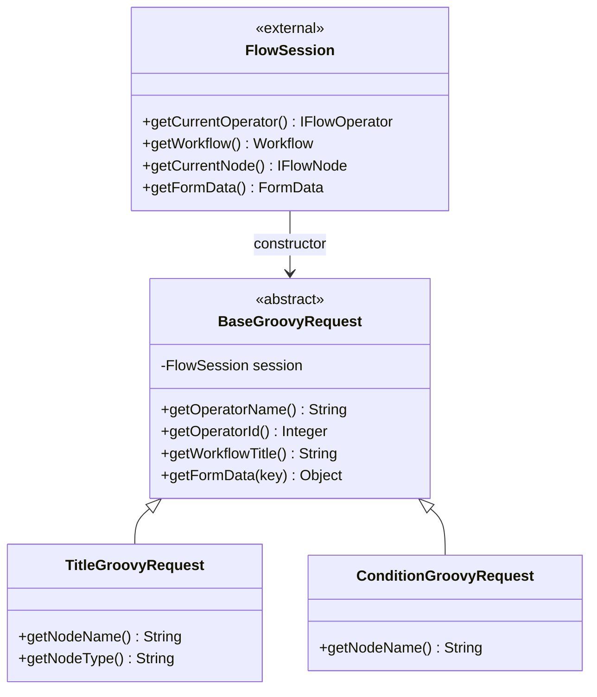
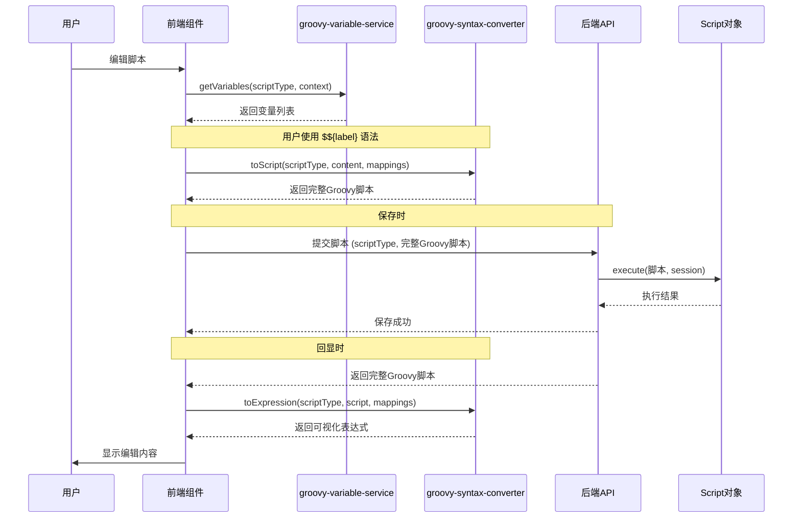

# Groovy 脚本处理架构统一优化计划（修订版）

## 背景

当前项目存在多个使用 Groovy 脚本的场景（标题脚本、条件脚本、人员加载脚本、自定义脚本等），但缺乏统一的抽象和复用机制：

- **后端**：每个脚本类型独立定义请求对象和执行器，难以扩展
- **前端**：只有标题脚本有完整的可视化配置 UI，其他脚本仅有简单 Input

## 优化目标

1. **后端**：Request 对象接受 FlowSession 自行提取数据，Script 直接执行前端传来的完整脚本
2. **前端**：在 flow-pc-design 模块下抽象 script 模块，包含类型定义、Service、组件

---

## 实施方案

### Phase 1: 后端 Request 对象重构

| 序号 | 文件 | 描述 |
|------|------|------|
| 1.1 | `flow-engine-framework/src/main/java/com/codingapi/flow/script/request/TitleGroovyRequest.java` | 标题脚本请求（移动+改造） |
| 1.2 | `flow-engine-framework/src/main/java/com/codingapi/flow/script/request/BaseGroovyRequest.java` | 抽象基类，构造函数接受 FlowSession |
| 1.3 | `flow-engine-framework/src/main/java/com/codingapi/flow/script/request/ConditionGroovyRequest.java` | 条件脚本请求（按需创建） |
| 1.4 | `flow-engine-framework/src/main/java/com/codingapi/flow/script/request/OperatorLoadGroovyRequest.java` | 人员加载脚本请求 |

**设计原则**：
- Request 对象构造函数接受 `FlowSession`，内部自行从 session 提取数据
- Script 对象直接执行前端传来的完整脚本

### Phase 2: 现有 Script 对象改造

| 序号 | 文件 | 描述 |
|------|------|------|
| 2.1 | `NodeTitleScript.java` | 改造为使用新的 TitleGroovyRequest |
| 2.2 | `ConditionScript.java` | 改造为使用新的 ConditionGroovyRequest |
| 2.3 | 其他脚本类 | 按需改造 |

---

### Phase 3: 前端 Script 模块 - 类型定义

| 序号 | 文件 | 描述 |
|------|------|------|
| 3.1 | `flow-pc/flow-pc-design/src/components/design-editor/types/groovy-script.ts` | 脚本类型枚举、变量映射定义 |

---

### Phase 4: 前端 Script 模块 - Service 层

| 序号 | 文件 | 描述 |
|------|------|------|
| 4.1 | `flow-pc/flow-pc-design/src/components/design-editor/script/service/groovy-syntax-converter.ts` | 脚本语法转换服务 |
| 4.2 | `flow-pc/flow-pc-design/src/components/design-editor/script/service/groovy-variable-service.ts` | 变量转换服务（支持多脚本类型） |

**Service 职责**：

```
groovy-variable-service.ts
├── getVariables(scriptType, context)        → 获取变量列表（给变量选择组件提供基础数据）
├── getSystemVariables(scriptType)            → 获取系统变量（按脚本类型）
├── getFormFieldVariables(formFields)        → 获取表单字段变量
└── registerAdapter(adapter)                  → 注册脚本适配器（扩展机制）

groovy-syntax-converter.ts
├── toScript(scriptType, content, mappings)  → 转换为完整Groovy脚本（编辑时）
├── toExpression(scriptType, script)         → 转换为可视化表达式（回显时）
├── getDefaultTemplate(scriptType)            → 获取默认脚本模板
└── registerAdapter(adapter)                  → 注册脚本适配器（扩展机制）
```

**适配器模式**：

```typescript
// 脚本适配器接口
interface ScriptAdapter {
  scriptType: ScriptType;
  getSystemVariables(): VariableItem[];           // 系统变量定义
  toScript(content: string, mappings: VariableMapping[]): string;   // 转换为脚本
  toExpression(script: string, mappings: VariableMapping[]): string; // 转换为表达式
  getDefaultTemplate(): string;                    // 默认模板
}

// 内置标题脚本适配器
const titleAdapter: ScriptAdapter = {
  scriptType: ScriptType.TITLE,
  getSystemVariables: () => [
    { label: '当前操作人', value: 'operatorName', expression: 'request.getOperatorName()' },
    { label: '流程标题', value: 'workflowTitle', expression: 'request.getWorkflowTitle()' },
    // ...
  ],
  toScript: (content, mappings) => { /* 转换逻辑 */ },
  toExpression: (script, mappings) => { /* 转换逻辑 */ },
  getDefaultTemplate: () => 'def run(request){ /** @TITLE */ return "" }'
};

// 注册适配器
groovyVariableService.registerAdapter(titleAdapter);
groovySyntaxConverter.registerAdapter(titleAdapter);
```

---

### Phase 5: 前端 Script 模块 - 组件层

| 序号 | 文件 | 描述 |
|------|------|------|
| 5.1 | `flow-pc/flow-pc-design/src/components/design-editor/node-components/scripts/components/script-editor.tsx` | 高级配置（自由编辑Groovy脚本） |
| 5.2 | `flow-pc/flow-pc-design/src/components/design-editor/node-components/scripts/components/variable-picker.tsx` | 参数变量选择组件（复用） |
| 5.3 | `flow-pc/flow-pc-design/src/components/design-editor/node-components/scripts/components/script-config-modal.tsx` | 通用脚本配置弹框 |
| 5.4 | `flow-pc/flow-pc-design/src/components/design-editor/node-components/scripts/title-config-modal.tsx` | 标题配置弹框（复用通用组件） |
| 5.5 | `flow-pc/flow-pc-design/src/components/design-editor/node-components/scripts/condition-config-modal.tsx` | 条件配置弹框 |

**组件关系**：



---

## 关键设计

### 后端类图（简化版）



### 前后端交互流程



---

## TDD 测试设计

### 后端测试

#### Phase 1: Request 对象测试

| 序号 | 测试类 | 测试内容 |
|------|--------|----------|
| 1.1 | `BaseGroovyRequestTest` | 验证抽象基类从 FlowSession 正确提取数据 |
| 1.2 | `TitleGroovyRequestTest` | 验证标题请求的字段完整性 |
| 1.3 | `ConditionGroovyRequestTest` | 验证条件请求的字段完整性 |
| 1.4 | `OperatorLoadGroovyRequestTest` | 验证人员加载请求的字段完整性 |

**测试用例设计**：

```java
// TitleGroovyRequestTest 示例
class TitleGroovyRequestTest {

    @Test
    void shouldExtractOperatorInfoFromSession() {
        // given: FlowSession with operator
        FlowSession session = createMockSession();

        // when: create TitleGroovyRequest
        TitleGroovyRequest request = new TitleGroovyRequest(session);

        // then: verify operator fields
        assertEquals("张三", request.getOperatorName());
        assertEquals(1001, request.getOperatorId());
    }

    @Test
    void shouldExtractWorkflowInfoFromSession() {
        // given: FlowSession with workflow
        FlowSession session = createMockSession();

        // when: create TitleGroovyRequest
        TitleGroovyRequest request = new TitleGroovyRequest(session);

        // then: verify workflow fields
        assertEquals("请假审批", request.getWorkflowTitle());
        assertEquals("LEAVE_001", request.getWorkflowCode());
    }

    @Test
    void shouldExtractFormDataFromSession() {
        // given: FlowSession with form data
        FlowSession session = createMockSessionWithFormData();

        // when: create TitleGroovyRequest
        TitleGroovyRequest request = new TitleGroovyRequest(session);

        // then: verify form data
        assertEquals("请假申请", request.getFormData("title"));
        assertEquals(3, request.getFormData("days"));
    }
}
```

#### Phase 2: Script 集成测试

| 序号 | 测试类 | 测试内容 |
|------|--------|----------|
| 2.1 | `NodeTitleScriptTest` | 验证标题脚本执行结果 |
| 2.2 | `ConditionScriptTest` | 验证条件脚本执行结果 |
| 2.3 | `ScriptIntegrationTest` | 验证前后端数据流一致性 |

---

### 前端测试

#### Phase 3: Service 层测试

| 序号 | 测试文件 | 测试内容 |
|------|----------|----------|
| 3.1 | `groovy-variable-service.test.ts` | 变量服务获取、适配器注册 |
| 3.2 | `groovy-syntax-converter.test.ts` | 语法转换（toScript/toExpression） |

**测试用例设计**：

```typescript
// groovy-syntax-converter.test.ts 示例
describe('groovy-syntax-converter', () => {
  describe('toScript', () => {
    it('should convert label expression to groovy script', () => {
      // given: 用户输入的标签表达式
      const content = '请假申请-${当前操作人}';
      const mappings = [
        { label: '当前操作人', value: 'operatorName', expression: 'request.getOperatorName()' }
      ];

      // when: 转换为Groovy脚本
      const result = toScript(ScriptType.TITLE, content, mappings);

      // then: 验证转换结果
      expect(result).toContain('request.getOperatorName()');
    });

    it('should handle empty content', () => {
      const result = toScript(ScriptType.TITLE, '', []);
      expect(result).toContain('def run(request)');
    });
  });

  describe('toExpression', () => {
    it('should convert groovy script to label expression', () => {
      // given: 后端返回的Groovy脚本
      const script = 'def run(request){ return "请假申请-" + request.getOperatorName() }';
      const mappings = [
        { label: '当前操作人', value: 'operatorName', expression: 'request.getOperatorName()' }
      ];

      // when: 转换为可视化表达式
      const result = toExpression(ScriptType.TITLE, script, mappings);

      // then: 验证转换结果
      expect(result).toBe('请假申请-${当前操作人}');
    });
  });

  describe('registerAdapter', () => {
    it('should register and use custom adapter', () => {
      const customAdapter = createAdapter(ScriptType.CUSTOM);
      registerAdapter(customAdapter);

      const result = toScript(ScriptType.CUSTOM, 'test', []);
      expect(result).toBeDefined();
    });
  });
});
```

#### Phase 4: 组件测试

| 序号 | 测试文件 | 测试内容 |
|------|----------|----------|
| 4.1 | `variable-picker.test.tsx` | 变量选择组件交互 |
| 4.2 | `script-config-modal.test.tsx` | 弹框组件集成 |

---

## 验证执行

1. **后端测试**：
   ```bash
   ./mvnw test -Dtest=*GroovyRequestTest
   ./mvnw test -Dtest=*ScriptTest
   ```

2. **前端测试**：
   ```bash
   pnpm test -- --filter=flow-pc-design
   ```

3. **构建验证**：
   ```bash
   ./mvnw clean install
   pnpm build
   ```
