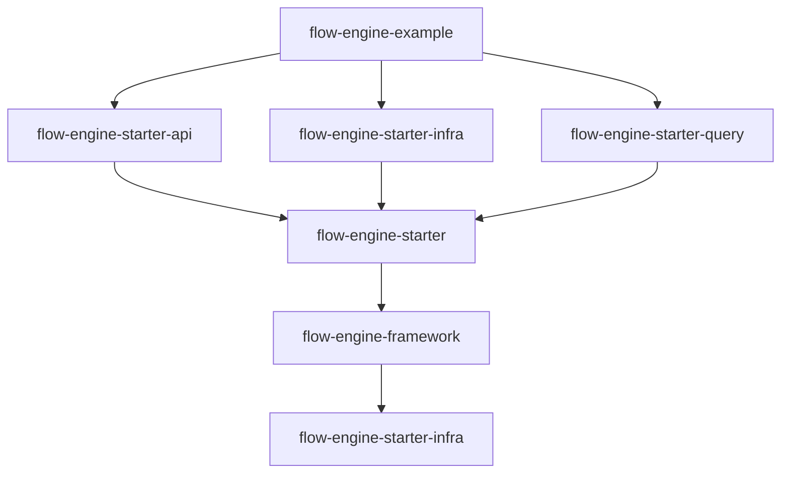

# 02 - 模块总览

## 后端模块划分

Flow Engine 后端由 6 个 Maven 模块组成，核心框架模块 `flow-engine-framework` 采用**八层架构**设计。

### Maven 模块

| 模块 | 说明 |
|------|------|
| `flow-engine-framework` | 核心工作流引擎框架（节点/动作/策略/脚本/服务） |
| `flow-engine-starter` | Spring Boot 自动配置入口 |
| `flow-engine-starter-api` | REST API 层（FlowRecordController、WorkflowController） |
| `flow-engine-starter-infra` | 持久化层（JPA 实体、8 个仓储实现、达梦方言） |
| `flow-engine-starter-query` | 查询层（FlowRecordQueryController、WorkflowQueryController） |
| `flow-engine-example` | 示例应用（H2/达梦、JWT 认证、端口 8090） |

### flow-engine-framework 八层架构

| 层级 | 说明 | 核心组件 |
|------|------|----------|
| **工作流层** | 流程定义 | `Workflow`, `WorkflowVersion` |
| **节点层** | 19 种节点类型 | `StartNode`, `ApprovalNode`, `RouterNode` 等 |
| **动作层** | 8 种动作类型 | `PassAction`, `RejectAction` 等 |
| **记录层** | 流程实例记录 | `FlowRecord`, `FlowTodoRecord` |
| **会话层** | 会话管理 | `FlowSession` |
| **管理器层** | 业务管理器 | `NodeStrategyManager`, `OperatorManager` |
| **策略层** | 策略驱动的配置 | `NodeStrategy`, `WorkflowStrategy` |
| **脚本层** | Groovy 脚本运行时 | `ScriptRuntimeContext` |

### 模块依赖关系



## 前端模块划分

前端采用 **pnpm monorepo** 架构，共 12 个 package。

### 目录结构

```
flow-frontend/
├── apps/
│   ├── app-pc/              # PC 端应用
│   └── app-mobile/          # 移动端应用
└── packages/
    ├── flow-core/           # 核心框架库
    ├── flow-types/          # 类型定义库
    ├── flow-icons/          # 图标库
    ├── flow-approval-presenter/  # 审批展示器框架
    ├── flow-design/         # 流程设计器组件库
    ├── flow-pc-ui/          # PC 端基础 UI 组件库
    ├── flow-pc-form/        # PC 端表单组件库
    ├── flow-pc-approval/    # PC 端审批组件库
    ├── flow-mobile-ui/      # 移动端基础 UI 组件库
    ├── flow-mobile-form/    # 移动端表单组件库
    └── flow-mobile-approval/# 移动端审批组件库
```

### 基础层模块

| 模块 | 职责 |
|------|------|
| `flow-core` | 全局框架依赖，只包含与 UI 无关的基础能力（HTTP、状态管理、工具函数等） |
| `flow-types` | 全局类型定义，包含流程审批相关的业务类型 |
| `flow-icons` | 图标库，提供统一的图标组件 |
| `flow-approval-presenter` | 审批展示器框架，基于 Redux 的状态管理 |

### PC 端模块

| 模块 | 职责 |
|------|------|
| `flow-pc-ui` | PC 端基础 UI 组件库（按钮、输入框等原子组件），依赖 Ant Design |
| `flow-pc-form` | PC 端表单组件库（表单设计器、表单渲染等） |
| `flow-pc-approval` | PC 端审批组件库（待办/已办/审批处理等） |
| `flow-design` | 流程设计器组件库（节点配置、属性面板、脚本配置等） |

### 移动端模块

| 模块 | 职责 |
|------|------|
| `flow-mobile-ui` | 移动端基础 UI 组件库，依赖 Ant Design Mobile |
| `flow-mobile-form` | 移动端表单组件库 |
| `flow-mobile-approval` | 移动端审批组件库 |
